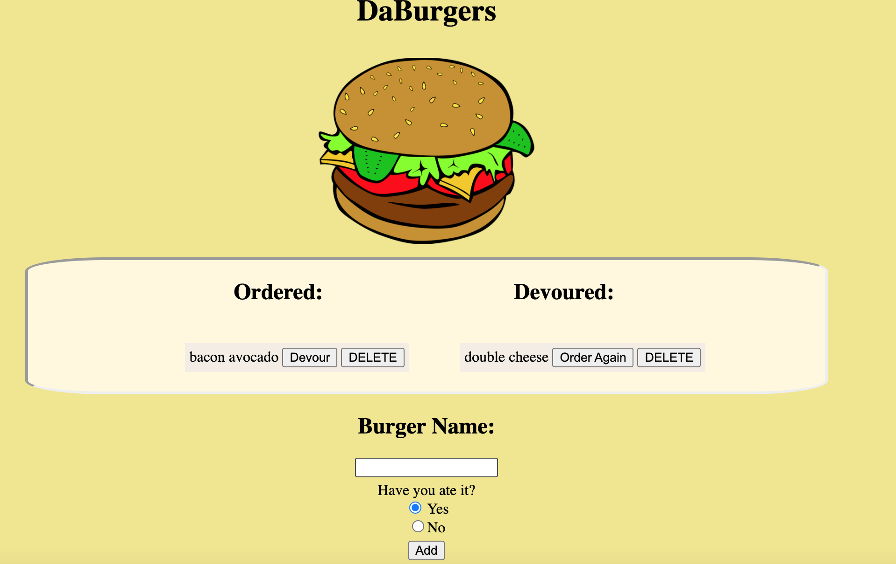

<h1 align="center">Da Burger</h1>



<br />
## Description
🔍 Burger Logger created using mySQl, Node, Express, Handlebars and also features Object-relational mapping. App is hosted by Heroku, and using JAWSDB to help create a connection with mySQL. 
## Table of Contents
- [Description](#description)
- [License](#license)
- [Installation](#Installation)
- [Contributing](#contributing)
- [Tests](#Tests)
## Installation
```
npm install express express-handlebars mysql

```
## Usage
```
node server.js
```
## Tests

## License

<br />
This application is covered by the MIT license. 
## Contributing
Eddie Ibarra
<br />
:octocat: Find me on GitHub: [ibarrasb](https://github.com/ibarrasb)<br />
<br />
✉Email me with any questions: eddieibarra43@gmail.com<br /><br />

    
